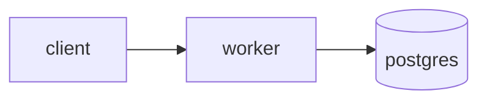

# <project-name>

> <The one-line pitch from the spec. This is also the GitHub repo description.>

**[Live demo](https://...)** · Built for phase <N> of [the sixty-week spine](https://github.com/<you>/sixty-week-spine)

<!-- A GIF or screenshot of it doing something real, right here. Above the fold. -->

## What it does

<Three or four sentences. Assume the reader has 60 seconds and has never heard of this.>

## Architecture

<A diagram. Mermaid renders on GitHub — use it rather than describing boxes in prose.>



## Why this design

<Three decisions and the alternative you rejected, one short paragraph each. This section is
half the value of the repo. Most portfolios skip it.>

1. **<Decision>** — chose X over Y because …
2. **<Decision>** — …
3. **<Decision>** — …

## Numbers

<Measured, not estimated. "About 40 req/s before the connection pool bites, here is the graph"
beats "it's fast" in every interview.>

| Metric | Value | How measured |
|---|---|---|
| | | |

## Where it fails

<Honest limitations. What breaks, at what scale, and what you would do about it. This is the
section that reads as senior.>

## Run it

```bash
git clone …
make demo
```

## Out of scope

<Copied from the spec. Says as much about your judgement as the feature list does.>

## Versions

<Every dependency that matters, pinned, with the date you last checked it. Cross-check against
the phase's newest file in `phases/phase-<N>/verified/`.>

_Last verified: <YYYY-MM-DD>_
